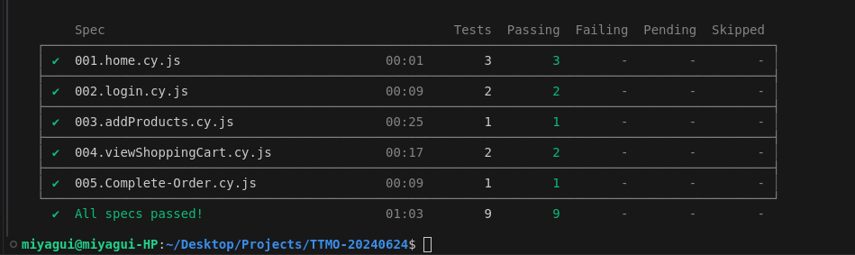
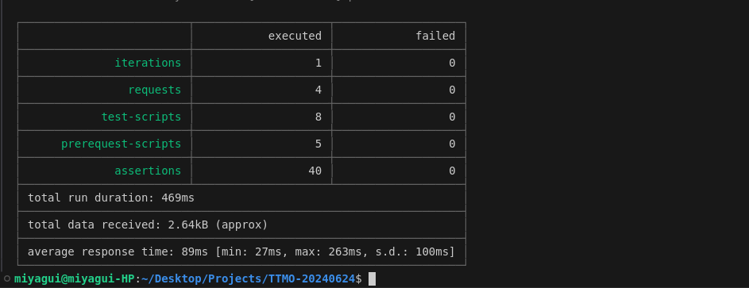
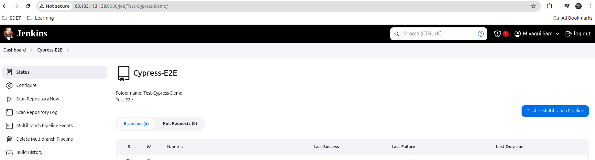
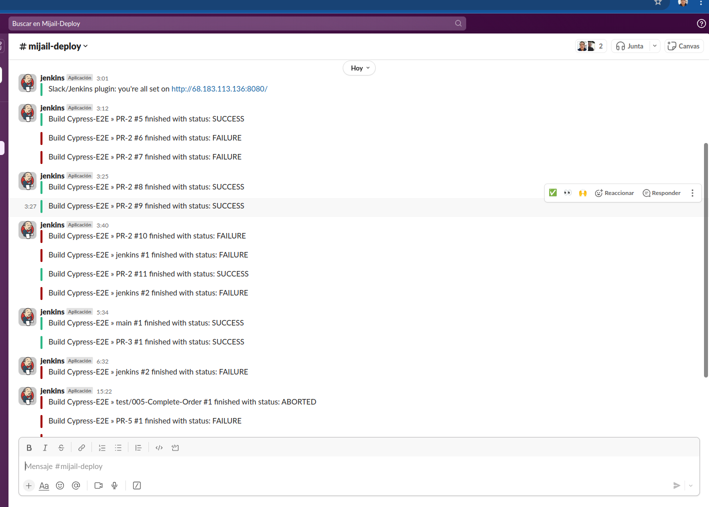

# TTMO-20240624

Prueba técnica desarrollada por Mijail Osorio utilizando Node.js.

## Instrucciones

1. Clone el repositorio o descomprima el archivo llamado `Mijail-Test.zip`.
2. Navegue hasta la carpeta raíz del proyecto o folder y ejecute el comando `npm install`.
3. Verifique que tenga instalado Newman; si no lo tiene instalado, puede hacerlo ejecutando el comando `npm install -g newman`.

## Run Test
1. Para Pruebas E2E ejecute el comando `npm start`
2. Para Pruebas API ejecute el comando `npm test`

# Detalle Prueba Técnica

Esta prueba técnica está dividida en dos partes:

### [01] Test E2E (End-to-End) con Cypress

Se utilizó Cypress para realizar pruebas E2E en el sitio [https://www.demoblaze.com/](https://www.demoblaze.com/).

#### Archivos de Pruebas:

1. **001.home.cy.js**
   - Verifica la página de inicio (Home Page).
   - Verifica el menú izquierdo.
   - Verifica la lista principal de productos.

2. **002.login.cy.js**
   - Registra un nuevo usuario.
   - Inicia sesión y cierra sesión.

3. **003.addProducts.cy.js**
   - Agregar Productos al Carrito

4. **004.viewShoppingCart.cy.js**
   - Verificar Productos en el Carrito
   - Verificar Total Price

5. **005.Complete-Order.cy.js**
   - Confirmar Productos 

### [02] Test API con Postman

Se utilizó Postman y Newman para desarrollar y ejecutar pruebas API.

#### Colección de Postman:

La colección de Postman contiene cuatro requests a [https://petstore.swagger.io](https://petstore.swagger.io).

1. **Add_New_Pet**
   - Crea una nueva Mascota, con datos random creados el el pre-request

2. **Get_Pet_By_Id**
   - Obtiene los datos de una mascota por Id
   - Se utiliza el Id de la mascota anterior

3. **Update_Pet**
   - Actualiza los campos name y status de una mascota
   - Se utiliza el Id de la mascota anterior

4. **Get_Pet_By_Status**
   - Se Verifica que los datos actualizados en el paso 3 fueron correctamede actualizados

# CI [Jenkins and Slack]
Este Projecto tiene un archivo JenkisnFile que permite crear un pipeline de pruebas, con stages simples pero que permiten  monitoriar el estado de la aplicacion.
Cada PR que se crea dispara automaticamente un Job en Jenkins que inicia las pruebas

## Jenkins
   - host: http://68.183.113.136:8080/
   - user: guest
   - pass: 4VWGVvjf6vqH
   - Nota: el usuario tiene resrticciones
   - 

## Slack 
   - host: https://app.slack.com/client/T079LHG27SN/C079LL45074
   - workspace: `mijail-deploy`
   - 

## stages
1. start
2. Checkout (Github)
    - Verifica y actualiza el repositorio
3. Install Dependencias
    - Run mon install
4. Tests-API
   - Run Test Postman
5. Tests-E2E
   - Run Test Cypress
6. Deploy
   - step default, pero puede incluir deploy a AWS
7. Post Actions
   - Envio de Notificacion Slack
8. End
